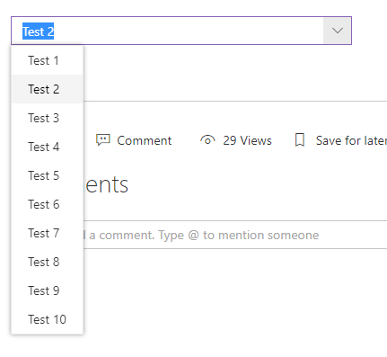
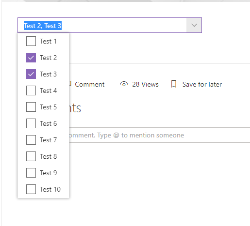

# ComboBoxListItemPicker control

This control allows you to select one or more items from a list. The List can be filtered to allow select items from a subset of items The item selection is based from a column value. The control will suggest items based on the inserted value.

Here is an example of the control:






## How to use this control in your solutions

- Check that you installed the `@pnp/spfx-controls-react` dependency. Check out the [getting started](../../#getting-started) page for more information about installing the dependency.
- Import the control into your component:

```TypeScript
import { ComboBoxListItemPicker } from '@pnp/spfx-controls-react/lib/ListItemPicker';
```
- Use the `ComboBoxListItemPicker` control in your code as follows:

```TypeScript
<ComboBoxListItemPicker listId='da8daf15-d84f-4ab1-9800-7568f82fed3f'
                        columnInternalName='Title'
                        orderBy='Title asc'
                        keyColumnInternalName='Id'
                        filter="Title eq 'SPFx'"
                        onSelectedItem={this.onSelectedItem}
                        webUrl={this.context.pageContext.web.absoluteUrl}
                        spHttpClient={this.context.spHttpClient} />
```

- Use the `ComboBoxListItemPicker` with objects passed in defaultSelectedItems

```TypeScript
<ComboBoxListItemPicker listId='da8daf15-d84f-4ab1-9800-7568f82fed3f'
                        columnInternalName='Title'
                        keyColumnInternalName='Id'
                        filter="Title eq 'SPFx'"
                        defaultSelectedItems=[{Id: 2, Title:"Test"}]
                        onSelectedItem={this.onSelectedItem}
                        webUrl={this.context.pageContext.web.absoluteUrl}
                        spHttpClient={this.context.spHttpClient} />
```

- Or only ids

```TypeScript
<ComboBoxListItemPicker listId='da8daf15-d84f-4ab1-9800-7568f82fed3f'
                        columnInternalName='Title'
                        keyColumnInternalName='Id'
                        filter="Title eq 'SPFx'" 
                        defaultSelectedItems: [2]
                        onSelectedItem={this.onSelectedItem}
                        webUrl={this.context.pageContext.web.absoluteUrl}
                        spHttpClient={this.context.spHttpClient} />
```

- The `onSelectedItem` change event returns the list items selected and can be implemented as follows:

```TypeScript
private onSelectedItem(items: []) {
    console.log("selected items:", items);
}
```

If you can provide typing details to the implementation based on `columnInternalName` and `keyColumnInternalName`.
For example above:

```typescript
columnInternalName='Title'
keyColumnInternalName='Id'
// ...
private onSelectedItem(items: { Title: string, Id: string }[]) {
    console.log("selected items:", items);
}
```

If you use variables for `columnInternalName` and `keyColumnInternalName` the typing will look as follow:
``` typescript
const columnInternalName = 'Title';
const keyColumnInternalName = 'Id';

<ComboBoxListItemPicker listId='da8daf15-d84f-4ab1-9800-7568f82fed3f'
                        columnInternalName={columnInternalName}
                        keyColumnInternalName={keyColumnInternalName}
                        filter="Title eq 'SPFx'" 
                        defaultSelectedItems: [2]
                        onSelectedItem={this.onSelectedItem}
                        webUrl={this.context.pageContext.web.absoluteUrl}
                        spHttpClient={this.context.spHttpClient} />

private onSelectedItem(items: { 
    [columnInternalName]: string, 
    [keyColumnInternalName]: string 
  }[]) {
    console.log("selected items:", items);
}
```

## Implementation

The `ComboBoxListItemPicker` control can be configured with the following properties:


| Property | Type | Required | Description |
| ---- | ---- | ---- | ---- |
| columnInternalName | string | yes | InternalName of column to search and get values. |
| keyColumnInternalName | string | no | InternalName of column to use as the key for the selection. Must be a column with unique values. Default: Id |
| webUrl | string | yes | Url to web hosting list |
| spHttpClient | RequestClient | yes | Any implementation of PnPJS RequestClient |
| listId | string | yes | Guid of the list. |
| onSelectItem | (items: any[]) => void | yes | Callback function which returns the selected items. |
| className | string | no | ClassName for the picker. |
| defaultSelectedItems | any[] | no | Initial items that have already been selected and should appear in the people picker. Support objects and Ids only |
| suggestionsHeaderText | string | no | The text that should appear at the top of the suggestion box. |
| noResultsFoundText | string | no | The text that should appear when no results are returned. |
| disabled | boolean | no | Specifies if the control is disabled or not. |
| filter | string | no | Condition to filter list Item, same as $filter ODATA parameter|
| multiSelect | boolean | no | Allows multiple selection|
| onInitialized | () => void | no | Calls when component is ready|
| itemLimit | number | no | Maximum number of items to be displayed in the combobox. Default: 100 |
| label | string | no | Specifies the text describing the combobox ListItemPicker. |
| orderBy | string | no | Specifies the sequence of the items in the comboBox ,same as $orderBy ODATA parameter|


