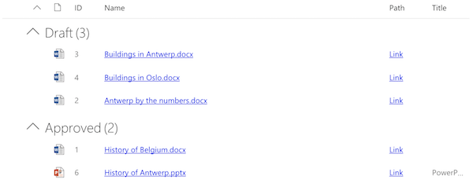

# ListView control

This control renders a list view for the given set of items.


**List view control with grouping applied**



## How to use this control in your solutions

- Check that you installed the `@pnp/spfx-controls-react` dependency. Check out the [getting started](../#getting-started) page for more information about installing the dependency.
- Import the following modules to your component:

```TypeScript
import { ListView, IViewField, SelectionMode, GroupOrder, IGrouping } from "@pnp/spfx-controls-react/lib/ListView";
```

- Use the `ListView` control in your code as follows:

```TypeScript
<ListView
  items={items}
  viewFields={viewFields}
  iconFieldName="ServerRelativeUrl"
  compact={true}
  selectionMode={SelectionMode.multiple}
  selection={this._getSelection}
  groupByFields={groupByFields} />
```

- With the `selection` property you can define a method that which gets called when the user selects one or more items in the list view:

```typescript
private _getSelection(items: any[]) {
  console.log('Selected items:', items);
}
```

- With the `groupByFields` property you can define an array of field objects which will be used for grouping. 

**Important**: the same order of the fields defines how grouping will be applied. In the snippet the `ListView` control will first group by the `Extension` and after that by the `Author` field.

```TypeScript
const groupByFields: IGrouping[] = [
  {
    name: "Extension", 
    order: GroupOrder.ascending 
  }, {
    name: "Author", 
    order: GroupOrder.descending
  }
];
```

## Implementation

The ListView control can be configured with the following properties:

| Property | Type | Required | Description |
| ---- | ---- | ---- | ---- |
| iconFieldName | string | no | Specify the name of the file URL path which will be used to show the file icon. |
| items | any[]| yes | Items to render in the list view. |
| viewFields | IViewField[] | no | The fields you want to render in the list view. Check the `IViewField` implementation to see which properties you can define. |
| compact | boolean | no | Boolean value to indicate if the control should render in compact mode. By default this is set to `false`. |
| selectionMode | SelectionMode | no | Specify if the items in the list view can be selected and how. Options are: none, single, multi. |
| selection | function | no | Selection event that passes the selected item(s) from the list view. |
| groupByFields | IGrouping[] | no | Defines the field on which you want to group the items in the list view. |
| defaultSelection | number[] | no | The index of the items to be select by default |

The `IViewField` has the following implementation:

| Property | Type | Required | Description |
| ---- | ---- | ---- | ---- |
| name | string | yes | Name of the field. |
| displayName | string | no | Name that will be used as the column title. If not defined, the name property will be used. |
| linkPropertyName | string | no | Specify the field name that needs to be used to render a link for the current field. |
| sorting | boolean | no | Specify if you want to enable sorting for the current field. |
| maxWidth | number | no | Specify the minimum width of the column. |
| maxWidth | number | no | Specify the maximum width of the column. |
| render | function | no | Override how the field has to get rendered. |

The `IGrouping` has the following implementation:

| Property | Type | Required | Description |
| ---- | ---- | ---- | ---- |
| name | string | yes | Name of the field |
| order | GroupOrder | yes | Specify how the group needs to be ordered. |

enum `GroupOrder`

| Value | Description |
| ---- | ---- |
| ascending | Order the group in ascending order. |
| descending | Order the group in descending order. |


