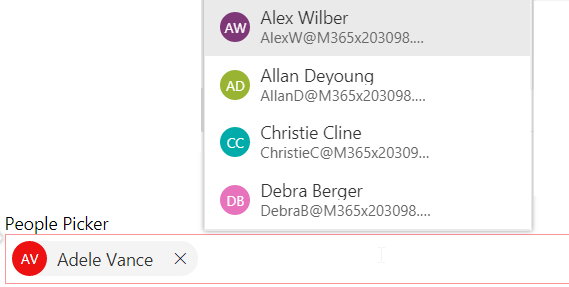

# People Picker

This control renders a People picker field which can be used to select one or more users from a SharePoint group or site. The control can be configured as mandatory. It will show a custom error message if field is empty.

**Empty People Picker control with error message and tooltip**


**Selecting People**



**Selected people** 


## How to use this control in your solutions

- Check that you installed the `@pnp/spfx-controls-react` dependency. Check out the [getting started](../../#getting-started) page for more information about installing the dependency.
- Import the following modules to your component:

```typescript
import { PeoplePicker, PrincipalType } from "@pnp/spfx-controls-react/lib/PeoplePicker";
```

- Use the `PeoplePicker` control in your code as follows:

```typescript
<PeoplePicker
    context={this.props.context}
    titleText="People Picker"
    personSelectionLimit={3}
    groupName={"Team Site Owners"} // Leave this blank in case you want to filter from all users
    showtooltip={true}
    required={true}
    disabled={true}
    onChange={this._getPeoplePickerItems}
    showHiddenInUI={false}
    principalTypes={[PrincipalType.User]}
    resolveDelay={1000} />
```

- With the `onChange` property you can get the selected People in the `PeoplePicker` :

```typescript
private _getPeoplePickerItems(items: any[]) {
  console.log('Items:', items);
}
```

## Implementation

The People picker control can be configured with the following properties:

| Property | Type | Required | Description | Default |
| ---- | ---- | ---- | ---- | ---- |
| context | WebPartContext | yes | Context of the current web part. | |
| titleText | string | no | Text to be displayed on the control | |
| groupName | string | no | group from which users are fetched. Leave it blank if need to filter all users | _none_ |
| personSelectionLimit | number | no | Defines the limit of people that can be selected in the control | 1 |
| required | boolean | no | Set if the control is required or not | false |
| disabled | boolean | no | Set if the control is disabled or not | false |
| errorMessage | string | no | Static error message displayed below the picker. Use `onGetErrorMessage` to dynamically change the error message displayed (if any) based on the current value. `errorMessage` and `onGetErrorMessage` are mutually exclusive (`errorMessage` takes precedence). | |
| onGetErrorMessage | (items: IPersonaProps[]) => string \| Promise&lt;string&gt; | no | The method is used to get the validation error message and determine whether the picker value is valid or not. Mutually exclusive with the static string `errorMessage` (it will take precedence over this).<br />When it returns string:<ul><li>If valid, it returns empty string.</li><li>If invalid, it returns the error message string to be shown below the picker.</li></ul><br />When it returns Promise&lt;string&gt;:<ul><li>The resolved value is display as error message.</li><li>The rejected, the value is thrown away.</li></ul> | |
| errorMessageClassName | string | no | applies custom styling to the error message section | |
| showtooltip | boolean | no | Defines if need a tooltip or not | false |
| tooltipMessage | string | no | Specify the tooltip message to display | |
| tooltipDirectional | DirectionalHint | no | Direction where the tooltip would be shown | |
| onChange | (items: IPersonaProps[]) => void | no | Get the selected users in the control. | |
| peoplePickerWPclassName | string | no | applies custom styling to the people picker element | |
| peoplePickerCntrlclassName | string | no | applies custom styling to the people picker control only | |
| defaultSelectedUsers | string[] | no | Default selected user emails or login names | |
| webAbsoluteUrl | string | no | Specify the site URL on which you want to perform the user query call. If not provided, the people picker will perform a tenant wide people/group search. When provided it will search users/groups on the provided site. | |
| principalTypes | PrincipalType[] | no | Define which type of data you want to retrieve: User, SharePoint groups, Security groups. Multiple are possible. | |
| ensureUser | boolean | no | When ensure user property is true, it will return the local user ID on the current site when doing a tenant wide search. | false |
| suggestionsLimit | number | no | Maximum number of suggestions to show in the full suggestion list. | 5 |
| resolveDelay | number | no | Add delay to resolve and search users | 200 |
| placeholder | string | no | Short text hint to display in empty picker |

Enum `PrincipalType`

The `PrincipalType` enum can be used to specify the types of information you want to query: User, Security groups, and/or SharePoint groups.

| Name | Value |
| ---- | ---- |
| User | 1 |
| DistributionList | 2 |
| SecurityGroup | 4 |
| SharePointGroup | 8 |


