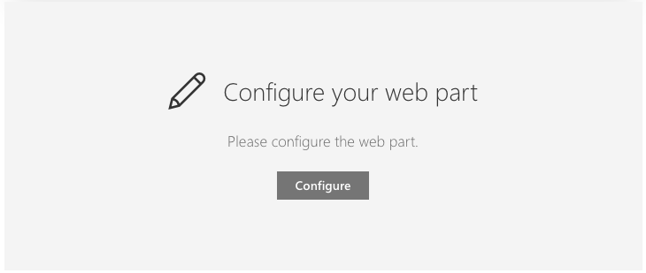

# Placeholder control

This control renders a placeholder which can be used to show a message that the web part still has to be configured.



## How to use this control in your solutions

- Check that you installed the `@pnp/spfx-controls-react` dependency. Check out the [getting started](../#getting-started) page for more information about installing the dependency.
- Import the following modules to your component:

```TypeScript
import { Placeholder } from "@pnp/spfx-controls-react/lib/Placeholder";
```

- Use the `Placeholder` control in your code as follows:

```TypeScript
<Placeholder
  iconName='Edit'
  iconText='Configure your web part'
  description='Please configure the web part.'
  buttonLabel='Configure'
  onConfigure={this._onConfigure} />
```

- With the `onConfigure` property you can define what it needs to do when you click on the button. Like for example opening the property pane:

```typescript
private _onConfigure() {
  // Context of the web part
  this.props.context.propertyPane.open();
}
```

## Implementation

The placeholder control can be configured with the following properties:

| Property | Type | Required | Description |
| ---- | ---- | ---- | ---- |
| buttonLabel | string | no | Text label to be displayed on the button bellow the description. The button is optional. |
| contentClassName | string | no | This is the className that is applied to the root element of the content zone. You can use this to apply custom styles to the placeholder. |
| description | string | yes | Text description for the placeholder. This appears bellow the Icon and IconText. |
| iconName | string | yes | The name of the icon that will be used in the placeholder. This is the same name as you can find on the Office UI Fabric icons page: [Office UI Fabric icons](https://dev.office.com/fabric#/styles/icons). For example: `Page` or `Add`. |
| iconText | string | yes | Heading text which is displayed next to the icon. |
| hideButton | boolean | no | Specify if you want to hide the button. Default is `false`. |
| onConfigure | function | no | onConfigure handler for the button. The button is optional. |


