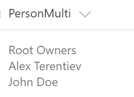
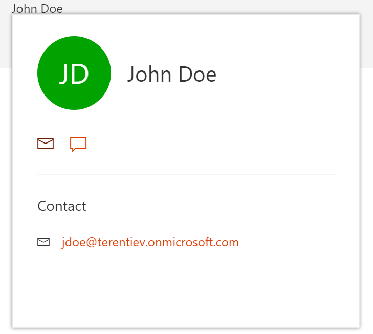

# FieldUserRenderer control

This control renders each referenced user/group as a link on a separate line. Hovering the link for users (not groups) leads to opening of Persona control.




**Note:** some icons may be rendered incorrectly if used with SharePoint Framework v1.3 or earlier

## Covered Fields
- Person or Group

## How to use this control in your solutions

- Check that you installed the `@pnp/spfx-controls-react` dependency. Check out the [getting started](../getting-started) page for more information about installing the dependency.
- Import the following modules to your component:

```TypeScript
import { FieldUserRenderer } from "@pnp/spfx-controls-react/lib/FieldUserRenderer";
```

- Use the `FieldUserRenderer` control in your code as follows:

```TypeScript
<FieldUserRenderer users={event.fieldValue} context={this.context} className={'some-class'} cssProps={{ background: '#f00' }} />
```

## Implementation

The FieldUserRenderer component can be configured with the following properties:

| Property | Type | Required | Description |
| ---- | ---- | ---- | ---- |
| cssProps | React.CSSProperties | no | CSS styles to apply to the renderer. |
| className | ICssInput | no | CSS classes to apply to the renderer. |
| users | IPrincipal | no | Users/groups to be displayed as they appear in `event.fieldValue` for Field Customizer's `onRenderCell` event. |
| context | IContext | yes | SPFx context. |


